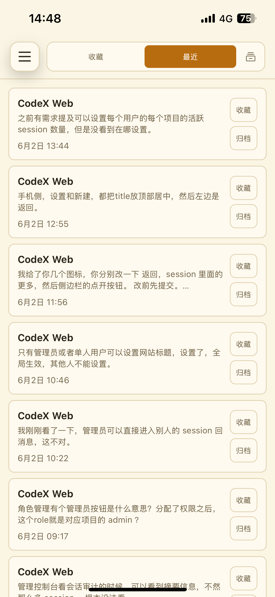
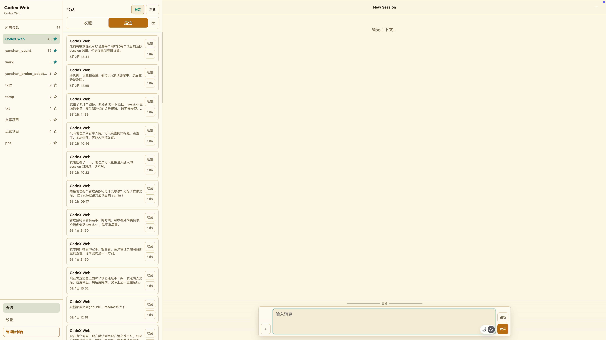
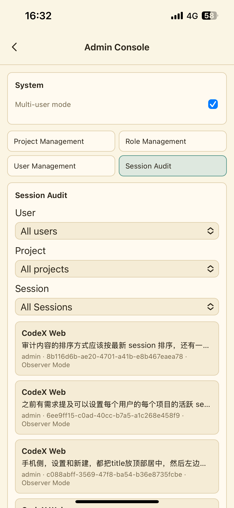
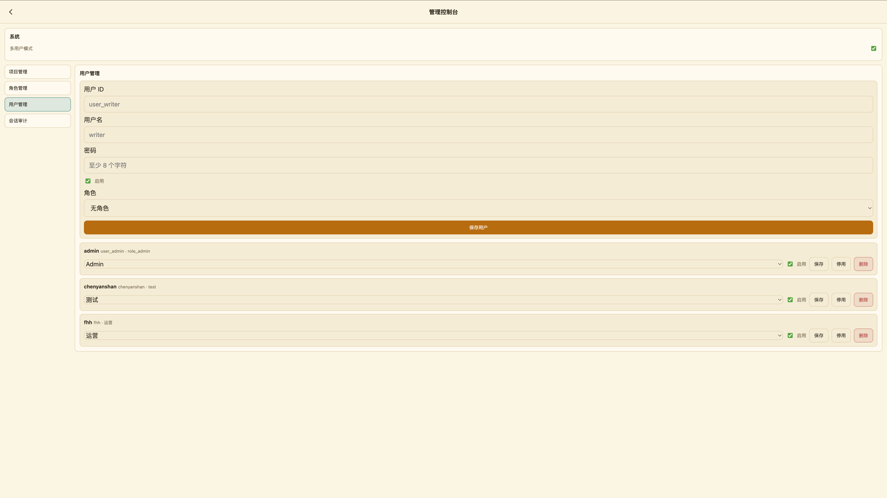

# Codex Web

[English](README.md) | 中文

这是一个自托管 Web 控制台，用来从手机、平板或桌面浏览器控制本机已经登录的
Codex runtime。

浏览器只是远程 UI。宿主机负责保存 Codex 凭据、启动 Codex
runtime、读写本地项目文件、执行 shell 命令，以及保存应用状态。公网访问、
tunnel、反向代理不属于本仓库范围。

> 让 Codex 直接安装：
> `帮我安装 https://github.com/chenyanshan/codex-web/blob/main/README.md`

## 核心亮点

### 1. 配合内网穿透，可远程随时操控 Codex

Codex Web 把 Codex 凭据、shell 执行能力和本地文件访问能力保留在宿主机上，
手机或浏览器只作为远程控制台使用。配合你自己的 tunnel、内网穿透或反向代理之
后，就可以在不把执行环境搬进浏览器的前提下，随时远程连回自己的 Codex。

| 手机远程控制台 | 桌面工作区 |
| --- | --- |
|  |  |

- 面向手机、平板和桌面浏览器的远程 UI。
- project-first workspace，实时展示会话列表、聊天和 turn 状态。
- 既适合局域网内访问，也适合接在你自己的远程访问入口之后使用。

### 2. 面向完全互信团队的多人访问控制层

Codex Web 提供 Web 层多人访问控制 facade，只适用于成员彼此完全信任的团队。RBAC
仅控制 Web UI 和 HTTP API 暴露的内容，不提供租户、OS 用户、进程、Codex runtime
或文件系统隔离。所有 turn 仍以同一个宿主机用户身份执行，并继承该 Codex runtime
允许的访问能力。不受信任用户必须拆分到独立 OS 用户、容器或主机。

| 手机管理审计 | 桌面用户管理 |
| --- | --- |
|  |  |

- 为完全互信团队提供多用户模式、项目管理、角色管理和用户管理。
- 提供 Web 层项目授权、admin 操作和 observer mode。
- 支持会话审计视图，按用户、项目、session 查看活动记录。

## 功能概览

- 密码保护的单主机 Codex Web 控制台。
- 适合手机安装的 PWA，按设备持久保存浏览器 session。
- 以项目为中心的响应式工作区：宽横屏桌面使用项目栏、会话列表、聊天三栏；窄窗口
  和竖屏桌面自动切换为单会话布局，并保留桌面尺寸的输入框；手机通过项目抽屉导航。
- 弱网恢复：设备端缓存会话摘要和最近使用的 5 个会话的有界对话记录，并持久化尚未
  完成同步的乐观消息和排队中的纯文本消息。
- 桌面端在对话顶部继续向上滚动、已安装 PWA 在时间线顶部下拉时，可逐步展开更早
  的对话。
- Codex turn 实时流：assistant delta、最终回答、命令批次、文件改动批次、
  approval 请求和 runtime 报错。
- 面向完全互信用户的多用户/RBAC facade：项目授权、admin 管理和 observer mode。
- 可选只读分享链接会打开独立对话页；公开分享默认关闭，必须由部署者显式开启。
- turn 文件和图片附件，桌面浏览器还可把剪贴板中的文件或图片直接粘贴到输入框。
  后端在本机保存文件，并把安全 local path 交给 Codex。
- 模型和推理选项来自当前 Codex CLI；当前 session 配置与本浏览器的新会话默认值
  分开管理。
- 在当前 session 对话内直接预览 Markdown、HTML、PDF、常见图片、网页链接，以及
  仍在保留期内的历史附件。
- 仓库自带 `codex-web-user-context` skill，可在明确需要时通过回环 HTTP API
  获取当前 Codex Web 登录用户和项目上下文。
- macOS launchd 服务脚本和 Linux systemd 配置说明。
- English / 简体中文 UI 语言设置，以及 admin/单用户可管理的站点标题。
- 11 套经过对比度校验的主题，首次使用默认日光黄，并提供纸白、石墨、北境蓝、
  森林绿、柔和玫瑰、深石墨琥珀、原子深色、复古暖色、摩卡柔彩和德古拉深色
  配色。

## 仓库结构

```text
packages/codex-native-api   可复用 Codex app-server 集成层
packages/codex-web          HTTP API、auth、runtime bridge 和 Web UI
scripts/install             面向 AI 的安装脚本
scripts/service             launchd 服务脚本
skills/codex-web-user-context  当前 Codex Web 用户/项目上下文 skill
docs/superpowers/specs      设计文档
docs/superpowers/plans      实现计划
docs/rendering              本地 Markdown/文件渲染验证材料
```

本仓库从 `CodexBridge-main` 拆分出来。

## 环境要求

- Node.js `>=24`
- npm
- 已安装本机 Codex CLI
- 本机 Codex 登录态位于 `~/.codex/auth.json` 或 `CODEX_HOME/auth.json`

## 快速开始

安装依赖：

```bash
npm install
```

设置 Web 密码：

```bash
npm run codex-web -- auth set-password
```

启动 Web 服务：

```bash
npm run serve
```

默认监听 `0.0.0.0:43210`，同一局域网内的手机可以访问。
`http://127.0.0.1:43210` 只能从宿主机本机访问。其他设备输入密码前，应在服务前
接入你自己的 HTTPS 反向代理、tunnel 或私有网络 HTTPS 入口；明文局域网 HTTP
无法保护密码和 bearer token，Service Worker 也要求安全上下文。

运行检查：

```bash
npm run build
npm run typecheck
npm test
npm run lint
```

浏览器测试使用 Playwright 和仓库自带的本地 fixture server：

```bash
npx playwright install chromium
npm run test:browser
```

## AI 安装入口

如果你希望让 Codex 或其他 coding agent 安装这个项目，请使用根目录的
[install.md](install.md)。它适用于 GitHub blob 链接和本地 checkout。

约定的 agent 行为：

- 如果用户发来 GitHub `README.md` 或 `install.md` blob 链接，先还原仓库根
  目录，再执行 `install.md`。
- 如果用户在本地 checkout 里说“帮我安装这个项目”，先定位仓库根目录，再执行
  `install.md`。
- macOS 上只询问是否安装 launchd 开机自启动。不要让用户在 agent 对话里发送
  密码；安装器会直接打开关闭回显的终端密码提示。
- Windows 上停止安装，并说明当前仓库没有 Windows 安装器。

macOS 自动安装流使用：

```text
install.md
scripts/install/install-codex-web-macos.sh
```

安装脚本会处理依赖安装、密码设置、服务启动、可选 launchd 自启动，以及安装仓库
自带的用户上下文 skill。

## 配置

运行时状态保存在仓库外。

默认路径：

```text
~/.config/codex-web/service.env
~/.codex-web/auth.json
~/.codex-web/identity.json
~/.codex-web/session-settings.json
~/.codex-web/session-timeline.json
~/.codex-web/logs/
~/.codex-web/reports/
~/.codex-web/report-index.json
~/.codex-web/uploads/
~/.codex-web/tasks/
```

`reports/` 和 `report-index.json` 仅用于保证旧版本生成的链接仍能打开。新的 session
文件保留在当前项目或附件存储中，Codex Web 不再提供全局 Reports 区域。

`auth.json` 保存单用户密码和 session token 的哈希；`identity.json` 保存多人模式
的密码、session token、分享 capability 的哈希，以及 Web 层授权元数据。两者都不
保存明文密码或 bearer token。就认证凭据而言，浏览器只保存不透明 session token。
不要把 `CODEX_WEB_PASSWORD` 写入 `service.env`。

非交互首次启动支持一次性 `CODEX_WEB_PASSWORD` 环境变量，但只能由本机 secret
manager 注入。不要把明文密码写进 shell history 或 service env 文件。

生成的 service env 包含以下核心默认项：

```env
CODEX_WEB_HOST=0.0.0.0
CODEX_WEB_PORT=43210
CODEX_WEB_DEFAULT_CWD=/Users/you/path/to/codex-web
CODEX_REAL_BIN=codex
CODEX_WEB_DEBUG=0
CODEX_WEB_PUBLIC_SHARES_ENABLED=false
CODEX_WEB_PUBLIC_SHARE_TTL_SECONDS=86400
```

如需修改监听地址、端口、默认工作目录或 Codex 可执行文件，编辑
`~/.config/codex-web/service.env`。如果只允许本机访问：

```env
CODEX_WEB_HOST=127.0.0.1
```

除非设置 `CODEX_WEB_PUBLIC_SHARES_ENABLED=true`，分享入口会保持隐藏，所有
`/api/share/*` 路由也会返回未找到。开启后，新链接默认 TTL 为 24 小时，由
`CODEX_WEB_PUBLIC_SHARE_TTL_SECONDS` 配置，最长不超过 7 天。链接被撤销或多人模式
关闭后也会立即失效。分享 URL 本质上是 bearer capability，必须按凭据保护。

### 用户 Webhook

完整的调用步骤、连续对话示例和错误说明见
[Webhook 使用指南](docs/webhook.md)。

每个已登录用户都可以在设置中开启一个 webhook key。当前 key 会一直显示在设置页，
可以随时复制，直到重新生成。为支持这个体验，Codex Web 会在权限为 `0600` 的本机
`identity.json` 中同时保存可恢复 key 和用于校验的哈希；浏览器只在内存中持有 key，
不会写入 local storage。旧版仅保存哈希的 key 需要重新生成一次，之后即可持续复制。
调用时应把 key 放在 `Authorization` header 中，不要放进 URL：

```bash
curl -X POST https://codex-web.example/api/webhook \
  -H 'Authorization: Bearer cwwh_REPLACE_ME' \
  -H 'Content-Type: application/json' \
  -H 'Idempotency-Key: support-conversation-123' \
  -d '{"projectId":"CodeX Web","title":"外部任务","text":"处理这个任务","model":"gpt-5.6-sol","reasoningEffort":"high"}'
```

`Idempotency-Key` 不是单条请求的去重 ID，而是一段对话的路由 key。第一次使用该 key
会创建 session 并启动第一个 turn；之后继续使用同一个 key，每次 `POST` 都会把一条
新消息发到原 session，包括内容完全相同的请求。要开始另一段独立对话，应换一个 key：

```bash
curl -X POST https://codex-web.example/api/webhook \
  -H 'Authorization: Bearer cwwh_REPLACE_ME' \
  -H 'Content-Type: application/json' \
  -H 'Idempotency-Key: support-conversation-123' \
  -d '{"projectId":"CodeX Web","text":"继续检查，并总结最重要的失败项"}'
```

该 key 长度必须为 1 到 256 个字符，按 webhook 所属用户隔离，并且会在服务重启和
webhook key 轮转后继续绑定原 session 和项目。多人模式下，后续请求仍须提供
`projectId`，且不能把同一个 key 切换到其他项目。

多人模式下，`projectId` 可以直接填写 Codex Web 界面显示的项目名，匹配时不区分
大小写；也兼容精确的内部项目 ID。新建项目或修改项目名时不允许出现重复显示名，
并且 key 所属用户必须有权在该项目创建 session。单用户模式省略 `projectId`，并使用
`CODEX_WEB_DEFAULT_CWD`。

`model` 和 `reasoningEffort` 都是可选字段。模型 ID 区分大小写，应使用 Codex Web
设置页展示的选项，或使用普通登录 token 请求 `GET /api/models`，读取 `items[].id` 和
对应的 `supportedReasoningEfforts`；webhook key 不能读取这个私有接口。可用模型和
思考强度由当前 Codex CLI 动态提供，`max`、`ultra` 等值并非对所有模型都有效。

两项都省略时，第一次请求继承目标工作目录的 Codex 配置，不读取浏览器本地的
“新会话”默认值；session 空闲后的续聊会保留该 session 当前设置。只提供 `model`
时使用该模型的 Codex 默认思考强度；只提供 `reasoningEffort` 时应用到有效模型。
不受支持的值会交给 Codex runtime 校验，并可能导致请求失败。

如果原 session 空闲，后续消息会启动一个新 turn；如果普通 turn 正在运行，则通过
Codex `turn/steer` 把消息加入当前 turn，不会先中断。review 和 compact turn 不能
steer，此时返回 `409 active_turn_not_steerable`，应等当前 turn 结束后重试。
`model` 和 `reasoningEffort` 只在启动新 turn 时生效；steer 到运行中 turn 的消息会
沿用该 turn 当前设置。`title` 只在第一次创建 session 时使用。

首次创建成功返回 `201 Created`；同 key 的后续消息被启动或 steer 后返回
`202 Accepted`。HTTP 成功响应表示消息已被接受。当前没有额外的单消息去重 ID，若
请求超时或响应丢失，重试可能把同一条消息发送两次；不能接受重复消息的调用方应先
核对结果再决定是否重试。映射 session 已归档、已删除或不再有权限时，不会静默创建
替代 session。

调用方不能覆盖 Codex 权限或 sandbox 设置，turn 使用服务端 runtime 默认值；当前
默认是 `danger-full-access` 和 `approvalPolicy=never`。Webhook key 可以在这台 Mac
上触发 Codex 工作，应当按密码级别保护。

### 浏览器缓存与弱网

Codex Web 会先显示本机浏览器缓存的会话摘要，再在后台向宿主机刷新。浏览器还会
为最近使用的最多 5 个会话保存有界对话数据，因此稳定会话在弱网下可以更快打开，
并在网络允许时继续与服务端的新状态校准。

用户消息会在 turn 请求完成前先以乐观状态持久化。当前 turn 运行期间排队的纯文本
消息也能跨刷新保留，并在活动 turn 状态校准后重试；turn 运行期间不能排队附件。

这属于弱网恢复，不是完整离线运行。启动 turn、上传文件和刷新服务端状态仍需要
连接宿主机，Service Worker 只缓存静态应用外壳。浏览器缓存可能包含对话文本，因此
应使用可信的浏览器 profile，并在停用设备时清除该站点的数据。

### 存储生命周期

Codex Web 只会按受管文件名或旧报告扩展名清理由自身管理的文件，不跟随符号链接，
也不会删除项目中的无关文件。清理发生在启动、受管写入前和读取旧报告前。Session
Viewer 从项目中打开的文件不由 Codex Web 管理或删除。达到配额时先删除过期的受管
文件，再从最旧的受管文件开始删除。

| 受管数据 | 默认策略 | 配置项 |
| --- | --- | --- |
| 状态目录 upload、turn 快照、旧报告、旧版 runtime context | 总计 2 GiB | `CODEX_WEB_MANAGED_STORAGE_MAX_BYTES` |
| 项目内 upload | 每项目 512 MiB | `CODEX_WEB_PROJECT_UPLOAD_MAX_BYTES` |
| 上传源文件 | TTL 7 天 | `CODEX_WEB_UPLOAD_TTL_SECONDS` |
| turn 附件快照 | TTL 30 天 | `CODEX_WEB_TURN_ATTACHMENT_TTL_SECONDS` |
| 旧报告 | TTL 365 天 | `CODEX_WEB_REPORT_TTL_SECONDS` |
| 旧版本遗留的 runtime context 文件 | TTL 30 天 | `CODEX_WEB_RUNTIME_CONTEXT_TTL_SECONDS` |
| 应用 timeline | 每 session 500 条、总计 16 MiB | `CODEX_WEB_TIMELINE_MAX_ENTRIES_PER_SESSION`、`CODEX_WEB_TIMELINE_MAX_BYTES` |

`~/.codex-web/reports/` 下的旧文件仍受对应 retention 与 quota 配置约束。该策略只为
兼容旧版本，不适用于当前 session 项目目录里的文件。

## 附件

消息输入框可以为下一次 Codex turn 上传文件和图片。桌面浏览器还可以把剪贴板中的
文件或图片直接粘贴到输入框。所有上传接口都需要鉴权。

项目目录可写时：

```text
<project-cwd>/uploads/<user-id>/
```

回退存储：

```text
~/.codex-web/uploads/projects/<project-key>/<user-id>/
```

后端会返回实际 `localPath`，并在启动 turn 前校验附件路径必须位于允许的 upload
roots 内。图片会作为 local image 传给 Codex；其他文件会以本机路径形式写入
turn prompt。

上传限制：

```text
32 MiB request body
25 MiB per file
```

上传源文件和不可变 turn 快照还会受上面的存储生命周期策略约束。

历史 session 中展示的附件，在上传源文件或不可变 turn 快照仍存在时可以直接点击。
已经被 retention 策略清理的附件无法重建，界面会显示为不可用。

## Session 文件查看器

文件属于对话内容，不再是独立的 Reports 产品。Assistant 在当前项目中生成并链接
文件后，可以直接从该 session 打开。相对路径以 session 项目根目录解析，访问范围
限制在当前项目和该 session 已授权的附件目录。

- Markdown 使用对话的 Markdown 渲染能力。
- 自包含的静态 HTML 在 sandbox viewer 中渲染；脚本、相对路径和远程子资源会被阻止。
- PDF 和常见图片格式在应用内打开。
- HTTP/HTTPS 链接按普通网页链接打开，后端不会代理目标网页。

`~/.codex-web/reports/` 下的旧链接仍可通过已鉴权兼容接口打开，但不再提供
全局 Reports 列表和 favorite 工作流。

## 用户上下文 Skill

Codex Web 用户上下文 skill 位于：

```text
skills/codex-web-user-context
```

安装到本机 Codex skills：

```bash
mkdir -p ~/.codex/skills
mkdir -p ~/.codex/skills/codex-web-user-context
cp -R skills/codex-web-user-context/. ~/.codex/skills/codex-web-user-context/
```

PowerShell：

```powershell
$target = Join-Path $HOME ".codex\skills\codex-web-user-context"
New-Item -ItemType Directory -Force $target | Out-Null
Copy-Item "skills/codex-web-user-context/*" $target -Recurse -Force
```

开发时建议使用软链接：

```bash
mkdir -p ~/.codex/skills
ln -s "$(pwd)/skills/codex-web-user-context" ~/.codex/skills/codex-web-user-context
```

> **升级时必须更新：**已经安装过该 skill 的用户，需要重新复制或安装
> `skills/codex-web-user-context`，然后重启 Codex 以重新加载 skill catalog。
> 旧版 skill 依赖 `CODEX_WEB_CONTEXT_FILE`，新版服务不再提供这个变量。

skill 会读取当前 `CODEX_THREAD_ID`，再通过 `CODEX_WEB_LOCAL_API_URL` 调用 Codex
Web。服务端只接受真实 socket 来自回环地址（`127.0.0.1` 或 `::1`）的请求，按
thread 映射实时的多人 session，并返回经过筛选的用户和项目字段；它不信任转发
请求头，也不提供 session 枚举接口。

普通 turn 的指令中不会再加入用户身份、项目元数据、skill 提示或 context 路径。
runtime 只获得回环 API 的 origin，只有 skill 被明确使用时才发起查询。因此 Codex
与 Codex Web 需要共享同一个宿主机网络命名空间。

## Runtime 状态

输入框上方的状态表示 runtime 状态，不只是请求 spinner。它会根据实时 turn 事件
和刷新后的 session history 校准。

- 活跃 turn 显示 `Running`。
- 可恢复的流中断会在 turn 仍活动时显示 `Reconnecting`。
- 空闲 session 和成功结束的 turn 显示 `Ready`。
- `interrupted`、`cancelled`、`aborted` 显示 `Stopped`。
- provider/runtime 报错显示 `Failed`；`401`、`403`、`429` 或 unexpected
  provider status 等详情会作为红色 system 消息展示在时间线中。

如果 Codex Web 服务在 turn 运行中重启，Codex 可能把该 turn 标为
`interrupted` 且没有 error payload。此时 UI 显示 `Stopped`，不显示红色报错，
因为这是服务生命周期打断。

## 更新已有的 macOS LaunchAgent 安装

拉取仓库更新不会热重载正在运行的 Codex Web 后端。对于由用户级 LaunchAgent
管理的现有 macOS 安装，请在仓库检出目录中拉取更新、安装依赖，然后重启服务：

```bash
git pull --ff-only
npm install
scripts/service/restart-codex-web-launchd-user.sh
```

重启后，请重新打开或刷新已安装的 PWA。

Codex Web 中显示的模型目录、配置默认值和模型声明的推理选项来自
`CODEX_REAL_BIN` 所选择的 Codex CLI。除非本浏览器显式覆盖新会话默认值，界面会
继承这些配置，而不是固定使用旧的 `gpt-5.4` / `xhigh`。只有当所选模型声明支持
`ultra` 时，界面才会显示该选项。仅拉取本仓库不会升级 Codex CLI，也不会为所选
运行时增加新能力。

## 服务安装

### macOS launchd

安装用户级 LaunchAgent：

```bash
scripts/service/install-codex-web-launchd-user.sh
```

服务管理脚本：

```bash
scripts/service/status-codex-web-launchd-user.sh
scripts/service/restart-codex-web-launchd-user.sh
scripts/service/restart-codex-web-launchd-user-detached.sh
scripts/service/logs-codex-web-launchd-user.sh
scripts/service/rotate-codex-web-logs.sh
scripts/service/stop-codex-web-launchd-user.sh
scripts/service/uninstall-codex-web-launchd-user.sh
```

当需要从 Codex 控制中的运行时重启 Codex Web 自身时，使用 detached 重启脚本。
卸载脚本会保留 `~/.config/codex-web/service.env` 和 `~/.codex-web/`。部署需要
自定义服务 label 时可设置 `CODEX_WEB_LAUNCHD_LABEL`。
安装器还会创建每小时运行一次的 `${CODEX_WEB_LAUNCHD_LABEL}.logrotate`
LaunchAgent。它通过 copy-truncate 轮转，不重启正在运行的服务；默认每个日志达到
10 MiB 时轮转并保留 5 代，阈值和代数由 `service.env` 中的
`CODEX_WEB_LOG_MAX_BYTES`、`CODEX_WEB_LOG_GENERATIONS` 控制。

### Linux systemd

创建服务环境文件：

```bash
mkdir -p ~/.config/codex-web ~/.codex-web/logs
cat > ~/.config/codex-web/service.env <<EOF
CODEX_WEB_HOST=0.0.0.0
CODEX_WEB_PORT=43210
CODEX_WEB_DEFAULT_CWD=$(pwd)
CODEX_REAL_BIN=codex
CODEX_WEB_DEBUG=0
EOF
chmod 600 ~/.config/codex-web/service.env
```

创建并启动用户服务：

```bash
mkdir -p ~/.config/systemd/user
cat > ~/.config/systemd/user/codex-web.service <<EOF
[Unit]
Description=Codex Web mobile console
After=network-online.target

[Service]
Type=simple
WorkingDirectory=$(pwd)
EnvironmentFile=%h/.config/codex-web/service.env
ExecStart=/usr/bin/env npm run serve --workspace packages/codex-web
Restart=on-failure
RestartSec=3

[Install]
WantedBy=default.target
EOF

systemctl --user daemon-reload
systemctl --user enable --now codex-web.service
systemctl --user status codex-web.service
```

查看日志：

```bash
journalctl --user -u codex-web.service -f
```

## 安装为 PWA

服务启动后，用手机浏览器打开 Codex Web，并在该设备上完成一次登录。

iPhone / iPad：用 Safari 打开，点 `分享`，再点 `添加到主屏幕`。

Android：用 Chrome 打开，打开浏览器菜单，再点 `Install app` 或
`Add to Home screen`。

更多说明见 [docs/pwa-setup.md](docs/pwa-setup.md)。

## 设计文档

设计和实现记录如下。文件工作流以 Session 文件查看器规范为准。

```text
docs/superpowers/specs/2026-05-17-codex-web-design.md
docs/superpowers/specs/2026-07-17-session-file-viewer-design.md
docs/superpowers/specs/2026-05-23-codex-web-desktop-workspace-design.md
docs/superpowers/specs/2026-05-27-codex-web-multi-user-rbac-design.md
docs/superpowers/specs/2026-05-28-role-project-new-session-design.md
docs/superpowers/specs/2026-05-29-codex-web-workspace-redesign-design.md
docs/superpowers/specs/2026-05-30-codex-web-attachments-design.md
docs/superpowers/specs/2026-06-01-session-card-first-message-design.md

docs/superpowers/plans/2026-05-17-codex-web-mvp.md
docs/superpowers/plans/2026-05-23-codex-web-desktop-workspace.md
docs/superpowers/plans/2026-05-27-codex-web-multi-user-rbac.md
docs/superpowers/plans/2026-05-28-role-project-new-session.md
docs/superpowers/plans/2026-05-29-codex-web-workspace-redesign.md
docs/superpowers/plans/2026-05-30-codex-web-attachments.md
docs/superpowers/plans/2026-06-01-session-card-first-message.md
docs/superpowers/plans/2026-06-01-timeline-error-ordering.md
```

视觉参考：

```text
docs/assets/codex-web-reference.jpg
```
