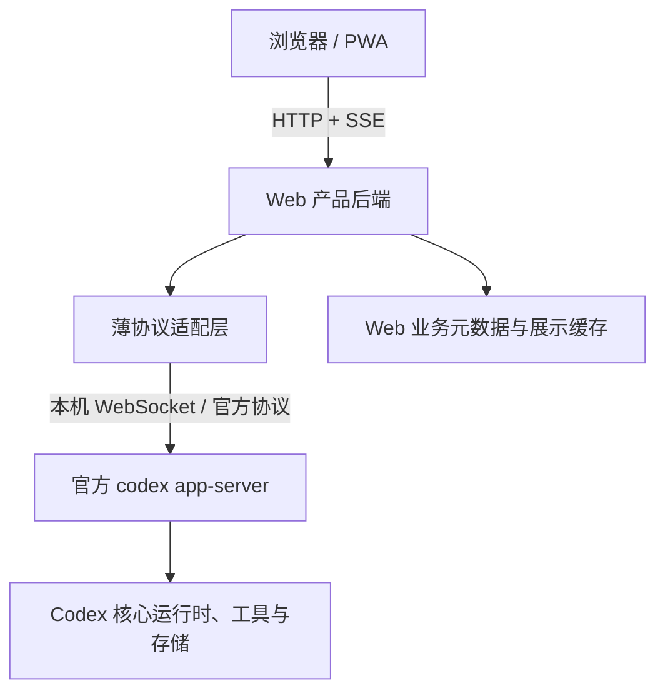

# Codex app-server 官方协议接入改造方案

日期：2026-09-24\
状态：方案已进入实现；核心代码及本地回归通过，生产切换尚未完成。\
范围：Codex Web 与本机 Codex app-server 的集成、状态恢复和版本兼容。

实施拆解见 [2026-09-25 实施计划](../superpowers/plans/2026-09-25-app-server-integration-refactor.md)。前端使用项目内 `frontend-design` 技能，按用户要求延续当前风格。

2026-09-25 实现结果见[实现与验收记录](../audits/2026-09-25-app-server-implementation.zh-CN.md)：最终源码通过最新稳定版 **0.156.1** 的真实模型与历史恢复检查，保留迁移前 0.153.4 的有限兼容。下文的“当前实现”描述设计时基线；最终代码、保留例外和未验证项以验收记录为准，不表示已完成上线。

后续改造必须遵守 [现有 21 项优化能力保留基线](2026-09-25-existing-optimizations-baseline.zh-CN.md)，保留弱网、消息送达、阅读与渲染、PWA、性能及权限机制；允许有验证依据的等价替换。

## 1. 需求与结论

用户已经可以通过升级 Codex CLI 使用新版 Codex。当前诉求不是新增更新器，而是减少自定义封装对旧协议、实验事件和内部存储格式的依赖，让升级后的兼容风险更小，同时保留现有手机与桌面 Web 使用体验。

**采用官方 app-server 的薄客户端架构，逐步精简现有底座，不整体重写。**

当前项目已经启动和调用官方 app-server。更新 Codex CLI 同时更新其附带的 app-server，因此本次不是替换执行引擎，也不是将底层源码复制进仓库。真正的改造对象是官方协议与 Web 产品之间的适配逻辑。

目标：

- 继续通过更新 Codex CLI 追新，默认跟随最新稳定发布版本，不长期冻结旧版。
- 尽可能使用目标发布版的非实验协议及官方生成类型。
- Codex 会话、任务和历史以官方状态为准，Web 缓存只作展示投影。
- 减少对原始事件、会话磁盘文件、stderr 文本和重复状态推断的依赖。
- 保留登录、项目授权、附件预览、PWA、SSE、Webhook 等现有产品能力。
- 将长期维护收敛为小范围协议适配、Web 产品维护和兼容验证。

不能承诺：任意未来版本零适配、所有新能力自动出现在 UI、官方协议永久向后兼容。官方生成类型也不提供运行时验证或自动重连。

## 2. 事实基线与证据边界

本轮只读检查确认本机 CLI 为 `0.153.4`。此前 GitHub 查询返回的最新稳定发布版为 `0.156.1`，发布时间为北京时间 2026-09-23 10:41；这只是调研时点记录，实施时必须重新确认。

已阅读的官方源码快照为 `421082e79d3186b0077bccbbbe2c77c0b1a26520`。该快照来自 `main`，**不能据此认定本机或某个稳定版已具备相同接口和行为**。选定实施基线后，必须对照该发布标签、二进制生成的协议及实际行为重新核实。

官方文档站在前序调研中返回 HTTP 403；本方案的官方实现依据为用户指定的 GitHub 源码及本机 CLI 帮助，不作未经验证的稳定性保证。

| 当前实现 | 已确认事实 | 改造含义 |
| --- | --- | --- |
| `CodexAppClient.startServer` | 启动 `codex app-server --listen ws://127.0.0.1:<port>`，完成初始化 | 已采用官方执行服务，无需换引擎 |
| thread/turn 方法 | 已调用创建、恢复、读取、取消订阅、发送、中断及 steer 等接口 | 保留已有能力，改进协议边界 |
| `initialize`、start/resume | 启用 `experimentalApi`、`experimentalRawEvents` | 逐项列出实际依赖，不能直接关闭 |
| `waitForTurnResult` | 同时使用通知、轮询、会话文件和 stderr 推断结果 | 优先审查的复杂性来源 |
| 会话文件辅助函数 | 直接读取文件并解析行，恢复完成状态、错误和工具事件 | 与内部存储结构耦合，需要替代证据 |
| Web runtime | 管理设置、时间线、任务映射、订阅和展示状态 | 分离业务元数据与官方执行状态 |
| Web event bus / server | 有界缓存、SSE 回放、慢客户端控制及鉴权 | 浏览器侧责任，不因官方有 WebSocket 而删除 |
| `codex-native-api` 包 | 还包含 Responses / Chat Completions facade 等入口 | 共用客户端改造需验证这些入口，不顺手移除 |

主要本地依据：

- [CodexAppClient](../../packages/codex-native-api/src/codex_app_client.ts)
- [Provider 类型](../../packages/codex-native-api/src/provider.ts)
- [Web runtime](../../packages/codex-web/src/runtime.ts)
- [Web 事件模型](../../packages/codex-web/src/event_model.ts)
- [事件缓存与回放](../../packages/codex-web/src/event_bus.ts)
- [HTTP / SSE 服务](../../packages/codex-web/src/server.ts)
- [文件访问边界](../../packages/codex-web/src/session_file_store.ts)

## 3. 目标架构与职责



第一阶段保留本机 WebSocket、现有 HTTP/SSE 契约和进程启动方式。改成 stdio、共享 daemon 或浏览器直连不会自然解决协议兼容问题，不作为本次前提。

| 层级 | 应负责 | 不应承担 |
| --- | --- | --- |
| 官方 app-server / runtime | Codex 任务执行、会话生命周期、审批协议、原始历史和工具能力 | Web 用户、项目授权与浏览器展示 |
| 薄适配层 | 类型化 RPC、初始化、连接与进程生命周期、关联请求、协议事件转换、必要兼容分支 | 另建 Agent 执行器或长期复制官方状态机 |
| Web 产品后端 | 登录、授权、项目元数据、附件、提交幂等、展示投影、SSE、Webhook | 根据文字内容猜测任务成功或失败 |
| 浏览器 | 展示、交互、离线缓存、待发送状态 | 保存 Codex 凭据或直接承担宿主机授权 |

“薄”指职责有限、可解释，不以代码行数作为唯一验收标准。必要的有界缓存、竞态处理和授权检查不能为减行数而删掉。

## 4. 改造决策

### 4.1 协议类型与运行时边界

使用指定 CLI 二进制生成协议，例如：

```bash
codex app-server generate-ts --out <临时输出目录>
```

本机生成器支持 `--experimental`；默认不带该参数，实验类型按需要单独管理。生成器本身在本机帮助中仍标记 experimental，不能把生成成功当作长期兼容承诺。

建议在现有 `codex-native-api` 包内建立以下模块，名称为规划而非已存在文件：

```text
src/app_server/
  generated/       官方协议类型及来源元数据
  transport.ts    请求、通知、服务端请求与断线管理
  client.ts       面向集成层的类型化接口
  capabilities.ts 已知版本能力与初始化结果
  compat/         有明确原因和退出条件的兼容分支
```

保留现有 `CodexAppClient` 导出作为过渡 facade，减少调用端同时迁移的风险。官方 wire 类型与 Web 事件类型分别维护：前者追随上游，后者保护产品契约。

生成产物记录版本、生成命令和来源；审查新增字段、删除字段、枚举变化以及实验标记。对外部消息做必要的结构检查，不能仅用 TypeScript 断言信任输入。

未知可选字段允许忽略；未知通知可有界记录。未知审批或其他要求客户端作答的请求必须显式报不支持，不能自动批准，也不能静默丢弃导致任务永久挂起。

### 4.2 能力判断与实验功能

不假设官方存在统一能力发现接口。优先使用目标版本实际提供的初始化能力、配置结果和只读查询；缺少发现机制时采用经过测试的版本能力表。

只有明确的“不支持方法/字段”才触发可选能力降级；认证失败、超时和服务错误不能被归类为“不支持”。不通过创建任务、修改文件或更改配置来探测能力。

建立实验依赖表：功能、方法/字段、目标版本、现有测试、替代方案、关闭后的用户影响。若目标版本的 goal、插件或其他现有能力仍要求实验开关，将其隔离并保留测试；不为关闭全局开关而直接牺牲现有功能。

### 4.3 状态与恢复

官方 thread/turn/item ID 是关联依据；Web session 与官方 thread 的现有映射保持兼容。Web 自有用户归属、授权、收藏、待提交消息、附件和审计数据继续保留。

目标数据流：官方生命周期事件驱动展示；首次加载和连接恢复时，通过目标版本支持的读取/恢复接口校准。正常连接期间减少无差别轮询；必要的受控校准可保留，必须有超时、退避和并发上限。

必须验证以下语义，而非仅替换方法名称：

- 响应之前到达的早期事件不能丢失，缓存必须有界。
- 历史快照与实时订阅交接不能漏消息或重复拼接；不同版本分别验证。
- 事件去重基于协议身份及生命周期，不能按文本相同去重；不能把本机连接序号当作跨重启的官方游标。
- 断线表示观测中断，不能直接判定执行失败或成功；无法确认时保留“状态待同步”。
- 请求已发出但响应丢失时，不自动重发 `turn/start` 等有副作用操作；先校准状态。上游没有幂等保证时明确保留不确定状态。
- 审批响应丢失时不得自动重复提交或接受；通过官方状态确认或提示重新处理。
- 没有最终文字的 turn 也可能正常结束；工具型结果、失败和中断按协议区分。
- SSE 重连只恢复浏览器显示，不重新提交 Codex 任务。

现有 Web 提交幂等与回执机制继续保留。与官方执行状态相关的展示缓存，应在重连校准后更新；旧缓存不能覆盖更新的官方结果。

### 4.4 会话文件与 stderr 兜底退出

会话文件读取和 stderr 解析属于具体补丁，不一次性删除。每项补丁登记：原始故障、受影响版本、触发条件、对应测试、官方替代接口及删除条件。

迁移顺序：先验证官方终态和错误事件，再验证历史中完整的工具结果与最终回答，最后将磁盘解析从正常路径移除。若官方仍无法覆盖某个故障，暂时留在 `compat/` 并明确支持范围。

stderr 保留为进程启动失败、崩溃等诊断来源；普通文本匹配不应在新主路径中独立决定某个 turn 的最终结果。共享进程的错误不能未经关联就归到某个用户任务。

### 4.5 Web 事件、文件与安全

保持当前 Web 事件契约，继续向浏览器提供 assistant delta/final、工作批次、审批和 turn 事件。官方通知在适配边界转换，不要求浏览器直接理解全部官方协议。

保留 SSE 游标、epoch/reset、缓存上限、慢客户端处理和持续授权检查。官方连接恢复与浏览器 SSE 恢复是两个不同链路。

官方有文件接口，不意味着应立即替换 Web 文件层。现有项目路径限制、符号链接与竞态校验、附件归属、Range 下载、预览和分享权限仍是产品责任。官方存储附件引用也不等于 Web 上传存储。

app-server 继续仅在本机连接。Web 用户仍共享宿主机执行身份；RBAC 不构成 OS、进程或文件系统隔离。公开分享保持默认关闭和 capability token 认证。不得通过改造扩大非管理员可访问范围。

## 5. 追新与版本兼容策略

仍以升级 Codex CLI 为追新入口，不要求另装一套 app-server，不自建上游 fork。

- **已验证版本**：记录通过兼容检查的精确 CLI 版本和协议生成版本，不是长期版本锁。
- **新稳定版**：尽快运行候选版本验证；通过后切换。未验证不等于已损坏，也不能显示为已兼容。
- **未知版本**：不因版本号陌生就一律拒绝；展示未验证状态并检查关键能力。缺少必需能力时停止相关操作并解释原因。
- **预发布版 / main**：用于提前发现变化，不默认替换用户正在使用的稳定运行时。
- **兼容窗口**：目标支持当前已验证稳定版和上一已验证稳定版；这是待建立的政策，不是现有保证。

类型生成在开发/验证阶段执行，不在服务每次启动时修改源码。运行服务记录实际启动的二进制路径和版本；不能把升级后 PATH 上的版本误当作已运行子进程的版本。

CLI 更新不会自动替换已运行的 app-server 子进程。切换前等待活跃任务结束或安排明确的维护窗口；审批等待和长任务也属于活跃工作。重启策略需与当前子进程所有权一致，不承诺切换期间任务无缝续跑。

候选验证使用临时项目和隔离状态目录，避免改动真实项目、占用生产端口或影响已有会话。需要真实登录的测试应设计受控凭据使用方式，不能提交或随意复制认证文件；涉及推理的测试有实际额度成本。

回退分为两类：Web 适配代码回退与 Codex 二进制回退。后者须确认历史/配置存储向后兼容；不兼容时不得让旧二进制直接打开新版修改的数据。备份和恢复应在写入停止的情况下实施，恢复会丢失备份后数据，不能静默执行。

自动检测、下载和切换版本的更新器属于可选后续工作，不是本次改造的必要条件，也未在本文中实施。

## 6. 分阶段实施与交付物

| 阶段 | 工作 | 交付与退出条件 | 规模判断 |
| --- | --- | --- | --- |
| P0：基线审计 | 对照目标稳定版列出全部 RPC、事件、实验依赖、兜底与调用端 | 协议映射表、补丁台账、当前行为基线；每项标明保留/替换/待证实 | 小到中 |
| P1：协议边界 | 引入官方类型、拆出 transport/client/capabilities，保留旧 facade | 现有调用端行为保持；生成来源可追溯；类型检查和适配层测试通过 | 中 |
| P2：状态与恢复 | 替换重复推断、缩减轮询和文件/stderr 兜底 | 断线、早期事件、审批、历史、并发和不确定提交测试通过；移除项有证据 | 中到大，主要风险所在 |
| P3：Web 对接收敛 | runtime 以官方状态为准，保留元数据与 SSE 投影 | HTTP/SSE/UI 契约兼容；鉴权、Webhook、附件和已有包入口回归通过 | 中 |
| P4：版本验证机制 | 候选 CLI 检查、版本诊断、升级与回退运行手册 | 两个已验证版本有记录，新版本差异能被定位 | 中 |

依赖顺序为 P0 → P1 → P2 → P3；兼容测试从 P0 开始贯穿各阶段，P4 汇总成可重复流程。不是等所有重构完成才补测试。

优先以“单个能力”切换，例如先完成读取和恢复，再处理任务终态；不同时重构前端、权限、文件存储和进程管理。需要对比旧路径时，仅对同一事件/快照做只读投影比较，不能启动两份真实任务。

用户工作区已有未提交变更，包括 runtime 和测试；实施时应先核实这些变更，避免覆盖或回退。本文新增独立文档，不改变这些文件。

不在 P0 前给出精确工期或删除比例。整体属于中等到较大的渐进式后端改造；“已经使用 app-server”不意味着删掉几层代码就能安全完成。

## 7. 验证与验收

测试分三层：可重复的协议消息 fixture 测试、隔离的真实 app-server 集成测试、浏览器端产品回归。Mock 测试不能替代真实版本兼容验证。

| 场景 | 验收结果 |
| --- | --- |
| 创建、恢复、列出和读取会话 | ID、顺序、配置及历史正确，未越权 |
| 流式文字、命令、文件改动 | 不漏项、不重复拼接，最终结果正确 |
| 事件早于 RPC 响应 | 有界缓冲并正确归属到 thread/turn |
| 成功、失败、中断、无文字结果 | 使用官方终态，保留明确错误，不用“有无文字”代替状态 |
| 审批等待、接受、拒绝 | 等待不误超时；决策正确关联；未知请求不自动接受 |
| 浏览器断线、后端连接断线 | 两段连接分别恢复；不重复执行任务 |
| 提交响应丢失 | 校准或显示不确定，不盲目重试副作用 |
| 服务重启、长任务与多设备 | 状态可重新读取，不虚报成功；不互相误取消订阅 |
| 多用户、分享、撤权 | 会话/事件/文件不泄露，撤权后的流停止 |
| 附件、预览、Webhook | 原有归属、路径边界、回执和幂等保持 |
| provider 401/403/429 等错误 | 可见且正确关联，不无限等待，不把暂时断线当终态 |
| 未知事件、可选接口缺失 | 明确降级；关键协议异常可诊断 |
| 当前和上一已验证 CLI | 核心契约均通过；实验功能单列结果 |

优先扩展现有测试，如 `codex_app_client_work_events.test.ts`、`runtime.test.ts`、`runtime_thread_subscription.test.ts`、`runtime_resolution.test.ts`、`events.test.ts`、`event_bus.test.ts`、`server_session_submission.test.ts`、`server_auth.test.ts`、`server_multi_user.test.ts` 和 `server_session_files.test.ts`。

每次行为改动添加对应测试并运行相关模块测试；TypeScript 改动必须运行 `npm run typecheck`。阶段合并时按影响范围运行 `npm test`、`npm run build`、`npm run lint` 和必要的浏览器回归。不要将 fixture 通过表述为真实模型或真实版本集成已通过。

完成标准：

1. 接入协议和生成产物来源明确，实验依赖有清单。
2. 新主路径使用官方状态，未依赖内部会话文件和 stderr 文本猜测任务结果；例外已隔离并有删除条件。
3. 既有 Web 能力和访问边界通过回归。
4. 新版本验证流程可重复，实际运行版本可查询，升级失败有明确处置路径。
5. 未解决兼容问题如实登记，不以减少代码量代替正确性。

## 8. 非目标与实施前待确认项

本次不重写 UI、不改成浏览器直连、不引入多租户执行隔离、不搬迁用户项目、不重新实现 Codex JSON-RPC 服务端，也不默认接入官方远程配对系统。

P0 需要通过技术验证回答：目标稳定版有哪些非实验事件可替代旧事件；历史接口是否覆盖现有工具结果；哪些异常仍需补丁；候选测试如何隔离状态并使用凭据；现有其他包入口对 `Provider*` 类型有哪些依赖。这些是实施调查项，不需要用户先决定协议细节。

## 9. 官方资料

- [调研源码快照](https://github.com/openai/codex/tree/421082e79d3186b0077bccbbbe2c77c0b1a26520/codex-rs/app-server)
- [请求处理与 ThreadManager 接入](https://github.com/openai/codex/blob/421082e79d3186b0077bccbbbe2c77c0b1a26520/codex-rs/app-server/src/message_processor.rs)
- [会话订阅与恢复状态](https://github.com/openai/codex/blob/421082e79d3186b0077bccbbbe2c77c0b1a26520/codex-rs/app-server/src/thread_state.rs)
- [传输与慢连接处理](https://github.com/openai/codex/blob/421082e79d3186b0077bccbbbe2c77c0b1a26520/codex-rs/app-server/src/transport.rs)
- [远程控制接口](https://github.com/openai/codex/blob/421082e79d3186b0077bccbbbe2c77c0b1a26520/codex-rs/app-server/src/request_processors/remote_control_processor.rs)
- [调研时的稳定版本 0.156.1](https://github.com/openai/codex/releases/tag/rust-v0.156.1)

官方 main 快照用于解释方向；最终实施依据必须切换为选定发布版本的协议与验证结果。
