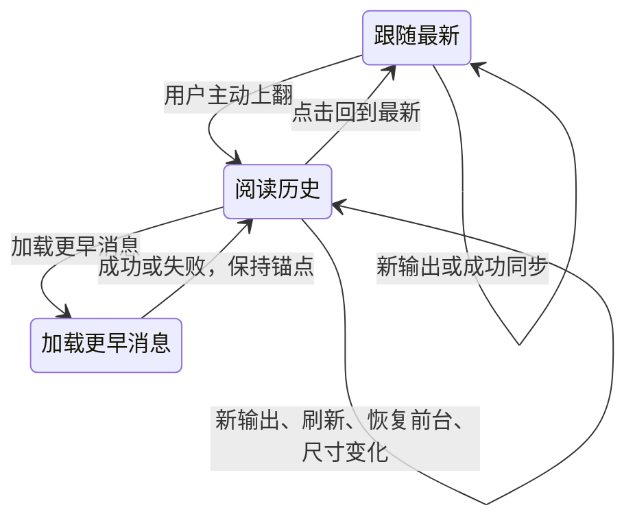

# Codex Web 二次全项目深度审计

> 后续用户覆盖项：普通会话进入与重载到最新；管理台只读查看从开头。管理会话列表恢复固定宽度与独立详情，取代本报告的按需展开布局建议。最终行为与证据以[整改验收记录](2026-09-19-second-remediation-progress.md)为准。

日期：2026-09-19。基线：首轮弱网修复上线后的工作区，页面版本 `aff5f81501d4d8edb820`。重点覆盖用户补充的 session 上下滚动与刷新、整体 UI、管理控制台，以及关联的后端、存储、交付和测试边界。

**建议下一轮首先修复会话阅读位置和管理编辑正确性，再调整页面布局。** 本轮已经复现 7 组 P1 问题：手机浏览器历史入口缺失、自动跳转阅读位置、迟到响应覆盖滚动位置、刷新失败没有反馈、管理表单编辑对象混用、旁观会话响应竞争、最后一位管理员可以停用自己。这些问题会直接影响日常使用，优先级高于换主题或增加功能。

本文件保留审计时的基线与发现，当时没有改动产品源码。后续实施与追加问题的验收见[二次审计整改与验收记录](2026-09-19-second-remediation-progress.md)；其中 S6 已按用户最新要求改为“进入、重新进入及整页重载均到最新位置”。前一轮弱网修复、会话命名和重命名见[整改记录](2026-09-19-remediation-progress.md)。原有会话搜索和状态筛选按用户要求保持移除。

## 1. 审查方式与证据范围

| 范围 | 本轮实际执行 |
| --- | --- |
| Session | 普通手机浏览器与模拟 PWA 的真实触摸手势；桌面 focus；只读会话视口变化；先到历史/迟到状态；慢刷新中继续滚动；503 刷新失败；浏览器 reload；上传中切换会话；通过实际事件处理器注入流式更新 |
| 管理控制台 | 项目/角色/用户/会话页面，正常、保存失败、重复提交、编辑对象切换、并发旁观、单接口失败、1,000 条会话压力场景 |
| UI | 1440×900、980×900、390×844、320×568；实际打开截图；五主题管理页文字对比度，包含透明前景与实际背景合成 |
| 后端 | 真实 HTTP server、AuthStore、HybridAuthStore、FileIdentityStore；临时状态目录与合成用户；Codex runtime 使用 stub，未启动模型任务 |
| 存储与交付 | 身份文件 1,000/10,000 条规模；报告索引外部更新；源码/构建资源体积；静态检查上传、指标、定时任务与服务脚本 |
| 工程边界 | 路由、状态归属、缓存和渲染入口、测试覆盖、前端类型检查范围；对大型文件采用调用链与风险路径审查，没有声称逐行证明整个项目正确 |

证据：[Session 实验](2026-09-19-second-deep-audit-evidence/session-checks.json) · [管理端与视觉实验](2026-09-19-second-deep-audit-evidence/browser-checks.json) · [后端与资源实验](2026-09-19-second-deep-audit-evidence/server-checks.json) · [验证汇总](2026-09-19-second-deep-audit-evidence/verification.json)。共完成 23 个浏览器诊断场景、7 个后端与资源实验，实际查看 25 张截图。相关脚本同目录保存，后端与前端关键源码哈希已记录；下文 `public/`、`src/` 路径均相对于 `packages/codex-web/`。

实验不读取实际登录令牌、真实会话或 service.env。PWA 使用 Chromium 模拟 standalone 环境；真实 iOS Safari 的地址栏、软键盘、橡皮筋滚动和系统返回手势仍需要真机验收。性能数字来自本机合成实验，不是生产 P95 或实际手机耗时。

## 2. Session：上下滚动与刷新的明确问题

### S1 · P1：普通手机浏览器缺少更早历史的操作入口

初始历史只展示最近两轮完整问答。本轮响应有 8 条消息，页面显示 4 条；普通手机浏览器滑到顶部并继续下拉后，仍然只有 4 条，没有“更早消息”按钮。相同数据在模拟 PWA 中下拉后可以显示 6 条。

原因是 `showMoreSessionHistory()` 只接入桌面滚轮和 standalone PWA 下拉；现有“更早消息”按钮只在当前内存时间线超过 80 条的 DOM 窗口中出现，无法覆盖初始只显示两轮的情况。普通触摸浏览器不满足这两种手势入口。

代码：`public/app.js:54`、`:2661`、`:5880`、`:12163`、`:12208`、`:13732`。截图：[普通手机历史顶部](2026-09-19-second-deep-audit-evidence/phone-browser-history-pull.png)。

**整改：** 顶部提供稳定、可聚焦的“加载更早消息”入口，任何设备都可使用；滚轮与触摸触顶加载作为增强。将“已加载数据的展示窗口”和“向服务端取历史分页”统一为一个入口，提供加载中、失败重试、没有更早消息三种反馈。

### S2 · P1：自动恢复和重绘会强制移动阅读位置

| 场景 | 复现结果 | 直接原因 |
| --- | --- | --- |
| 桌面正在向上阅读，窗口重新获得焦点 | `scrollTop` 从 250 变为 444，即当时的底部；跟随标记从 false 变为 true | `recoverActiveTurnAfterForeground()` 和刷新路径对桌面使用 `latestTimelineViewportSnapshot()` |
| 手机只读会话，正在中间阅读，视口高度由 844 变为 780 | `scrollTop` 从 550 变为 0 | `render()` 每次都把“只读且不跟随最新”当成首次打开，调用 `scrollTimelineToTop()` |

第二个场景用实际 resize 监听复现，不依赖修改产品状态。它说明只读阅读时的高度变化存在缺陷；不能直接把 Chromium 高度调整称为真实 iOS 地址栏测试。

代码：`public/app.js:808`、`:1515`、`:5640`、`:8794`、`:12903`、`:13946`。

**整改：** 首次打开定位只执行一次；前台恢复、状态刷新、主题/尺寸变化都保持阅读锚点。只有用户明确“回到最新”，或者本来就在实际时间线底部，才继续跟随输出。

### S3 · P1：迟到响应覆盖用户最新的滚动意图

已经复现两条独立路径：

- 历史先出现、状态仍等待时，用户上翻到 250px；状态返回后跳到 1,039px 的底部。
- 慢刷新发起时位置在 250px；等待期间用户继续读到 700px；响应返回后又被恢复到 250px。

前一条来自 `selectSession()` 的渐进更新使用“最新消息”快照；后一条来自刷新开始时保存的快照在响应完成后无条件应用。仅增加 AbortController 或缩短请求超时不能解决同一会话内的这个问题。

代码：`public/app.js:6269`、`:6306`、`:8794`、`:8829`、`:5607`。

**整改：** 引入用户滚动版本号。请求保存开始版本；若等待期间用户滚动，响应只更新数据，并以当前可见消息为锚点，不使用旧位置。锚点保存 `sessionId + messageId + 消息内偏移`，不能只保存距底部距离。

### S4 · P1：刷新失败会被表现为“就绪”

模拟 PWA 从标题栏下拉刷新，让 `/status` 和 `/timeline` 同时返回 503：两次请求确实发出，但最终 `status = Ready`，`error`、`sessionHistoryError`、`sessionStatusError` 都为空，界面没有错误入口。

初次打开会话已接入部分失败反馈；后续 `refreshCurrentSessionMetadata()` 仍会吞掉非认证异常并返回 null，调用方 `refreshCurrentView()` 又恢复“就绪”。两条流程的状态契约不一致。

代码：`public/app.js:8777`、`:8850`、`:9874`。截图：[刷新失败后仍显示就绪](2026-09-19-second-deep-audit-evidence/phone-refresh-failure-feedback.png)。

**整改：** 刷新返回明确的成功/部分成功/失败结果；保留现有消息，展示“同步失败，当前为上次内容”和就地重试。任务是否运行、网络是否连接、内容是否同步分别维护，不能用同一个 Ready 覆盖它们。

### S5 · P2：下拉手势的名称与实际行为不一致

PWA 在消息区下拉实际执行“加载更早历史”，只有从标题栏开始下拉才刷新。已到最早历史时，在消息区继续下拉会出现刷新提示，但不会产生任何刷新请求。本轮记录额外请求为 0，提示文字仍为 `Pull to refresh`；该组件文案也没有接入中文翻译。

此外，异步加载更早一页时，`showMoreSessionHistory()` 只返回布尔值，`handlePwaPullRefresh()` 立即返回已完成 Promise，指示器生命周期不能代表分页请求仍在进行。

代码：`public/pwa-pull-refresh.js:38`、`:86`；`public/app.js:12219`、`:13749`。

**整改：** 历史加载和刷新使用不同且明确的入口与文案；触顶拉取历史时提示“加载更早消息”，到尽头明确反馈。刷新在标题菜单或小型按钮中提供可见入口，支持键盘与普通浏览器；下拉调用等待真实分页 Promise。

### S6 · P2：reload 恢复了会话，没有恢复阅读位置

同一会话在 300px 阅读，浏览器刷新后变为 1,039px 的底部。现有缓存保存会话、消息与草稿，但没有按会话持久化阅读锚点和展示窗口；恢复后沿用打开会话的默认定位。

**整改：** 持久化最近会话的阅读锚点、是否跟随最新及窗口范围。锚点不存在时靠近相邻消息降级；用户本来跟随最新时再定位到底部。缓存继续遵守账户与会话权限边界。

### S7 · P2：旧会话附件上传结果污染新会话状态

在会话 A 上传文件，上传未完成时返回并打开会话 B，再让旧上传返回 503。B 没有附件，却显示 `Upload failed` 和 A 的上传错误。实测当前会话保持 B，但错误和状态已经被旧请求覆盖。

代码：`public/app.js:5374`–`:5424`。上传函数缺少会话/账户请求归属，最后直接保存当前草稿并渲染当前页面。

**整改：** 上传操作绑定账户、草稿/会话、附件 ID 与 generation；迟到结果只更新原草稿，不能写当前会话状态。再补充进度、取消和单文件重试；请求截止不能直接沿用普通 GET 的 12 秒值。

### 哪些行为本轮没有复现问题

在固定会话里向上阅读时，通过实际事件处理器追加流式内容，`scrollTop` 保持 250px，首条可见消息及偏移也不变。问题集中在恢复、刷新、重绘和导航边界，不能概括为所有流式更新都强制滚动。前一轮验证的草稿恢复、提交 ID 去重、SSE 502/503 自动重连继续保留。

## 3. 管理控制台：正确性与操作流程

### C1 · P1：切换编辑对象后，表单混用前一个对象的输入

实际操作：编辑项目 A，修改名称和工作目录，随后点击项目 B 的“编辑”。`editingProjectId` 已经是 B，但名称和目录仍然是刚为 A 输入的内容；B 的上限和勾选项又已经切换过来，形成混合表单。继续保存会把这些值提交给 B。

根因是通用 `reconcileWorkspaceNode()` 对可编辑 input 保留 DOM value，对 checkbox/select 又采用新值；表单没有按实体 ID 重置的受控草稿。这个规则适合保护部分输入，但不能替代编辑器的状态模型。

代码：`public/app.js:824`、`:4500`、`:9284`；`public/admin-ui.js:45`。截图：[切到 B 后仍保留 A 的名称和路径](2026-09-19-second-deep-audit-evidence/desktop-admin-wrong-edit-draft.png)。

**整改：** 表单草稿按对象类型与 ID 管理；切换对象明确加载对应草稿或服务端值。保存始终提交与表单当前对象绑定的快照；草稿未保存时采用保留或离开提醒策略。项目、用户、角色共用该规则，不仅修补某一个 input。

### C2 · P1：旁观会话缺少导航响应归属

先点会话 A，延迟它的详情请求，再点会话 B。B 先显示；A 的响应到达后，`state.sessionId` 从 B 变回 A。

`openAdminObservedSession()` 只检查认证 generation，没有校验当前旁观请求或导航意图。普通会话选择已有请求归属模块，管理端没有复用。

代码：`public/app.js:9524`。**整改：** 复用导航控制器和请求 ID，切换或退出旁观取消旧请求，迟到成功、异常和 finally 都校验归属。

### C3 · P1：最后一位管理员可以通过编辑表单停用自己

用户列表把当前账户的“停用”和“删除”按钮禁用了，但编辑表单仍可取消“启用”或更换角色。隔离真实 HTTP 实验中，唯一管理员发送 `PATCH /api/admin/users/user_admin` 停用自己，接口返回 200；有效管理员变为 0，后续管理请求返回 503。

代码：`public/admin-ui.js:88`、`:126`；`src/server.ts:5151`；`src/identity_store.ts:264`、`:290`。

这是可用性和管理误操作问题，不是未认证越权。**整改：** 服务端在同一持久化锁内校验“至少保留一位可登录管理员”，覆盖停用、角色变更、角色修改和删除；拒绝时返回明确的冲突错误。前端展示对象及影响，不能仅禁用行内按钮。

### 其他确认的问题

| ID / 优先级 | 证据与影响 | 整改方向 |
| --- | --- | --- |
| C4 / P2 · 保存状态不完整 | 保存按钮等待时仍可点，两次点击发出两次 POST；项目保存 409 后，文本保留，但原本取消的“启用”被重新勾上；切管理页再回来，未保存输入消失 | 每个表单有独立草稿、dirty、saving、error、saved；提交中阻止重复请求；失败保留全部字段；对写入结果未知与明确失败分别处理 |
| C5 / P2 · 一处加载失败清空整个管理视图 | `/api/admin/roles` 单独返回 503，已成功的项目、用户、会话都没应用，状态长度全为 0；`refreshAdminConsole()` 使用 Promise.all 后统一赋值 | 按当前页面加载，公共依赖各自缓存与重试；错误不显示成“0 条记录”；编辑一个对象后定向刷新 |
| C6 / P2 · 管理会话没有分页 | 请求 `?limit=30` 仍返回 1,000 条、358,681 bytes 未压缩 JSON，缺少 cursor；前端挂载 1,000 行、9,107 个 DOM 节点，4 倍 CPU 降速下同步 render 约 127–144ms | 服务端分页与稳定游标；前端增量加载、必要时窗口化；可复用普通会话目录，但保留管理员授权语义 |
| C7 / P2 · 管理端没有复用会话名称 | 管理列表以项目名为主标题，HTTP DTO 没有 title；摘要优先首条输入，用户刚改的会话名称在这里看不到 | DTO 保留 native title，复用 `sessionDisplayTitle()` 展示优先级，项目与所有者降为次级信息；旁观保持只读 |
| C8 / P2 · “全部会话”实际请求了未归档会话 | 前端选择 all 时省略 state；后端省略参数默认 active。实测 1,000 条含 1 条归档时，默认接口 999 条，`state=all` 1,000 条 | 显式传 `state=all`，补充前后端集成用例；不要让 fixture 无条件返回同一数组掩盖契约差异 |

位置：C4 `public/app.js:9329`–`:9509`；C5 `:9147`；C6 `src/server.ts:4168`、`public/admin-ui.js:140`；C7 `src/server.ts:5887`、`:5949`、`public/admin-ui.js:141`；C8 `public/app.js:12927`、`src/server.ts:6567`。

## 4. UI 与管理台布局建议

### 4.1 保留的基础

目前已有清晰的主会话工作区、项目导航、系统字体、五主题、16px 手机输入框以及关键触摸按钮。此次四个视口的用户管理页没有文档横向溢出；手机用户操作按钮高度为 44px。会话管理页的中间宽度仍有面板裁切，见下一节。主题本身不需要推翻。

真正需要调整的是信息出现的顺序、无关区域占用的空间、状态反馈与组件行为。截图中的控件都来自当前真实页面，不是视觉稿。

### 4.2 管理台应先看记录，再编辑记录

390×844 用户管理页的新增表单位于 438–831px，第一条现有用户记录从 **907px** 才开始。即使只是想停用某个用户，也先看到系统模式卡片、四项导航和完整创建表单。320px 下问题更明显。桌面会话审查未选择对象时，右侧空详情也持续占据约半个工作区。

截图：[手机用户管理](2026-09-19-second-deep-audit-evidence/phone-admin-users.png) · [980px 项目管理](2026-09-19-second-deep-audit-evidence/intermediate-admin-projects.png) · [桌面会话审查](2026-09-19-second-deep-audit-evidence/desktop-admin-sessions.png)。

**P2：中间宽度的管理会话详情被裁切。** 980px 宽的桌面浏览器已启用三栏布局，但列最小宽度为 `216px + 400px + 440px`，再加列间距与页边距，超过可用空间。实测详情面板右边界为 1,102px，超出视口 122px；“只读”徽章整体位于屏幕外。外层 `overflow: hidden` 使文档宽度仍为 980px，不能把没有横向滚动条当作布局通过。代码：`public/styles.css:4551`、`:4581`；截图：[980px 会话管理裁切](2026-09-19-second-deep-audit-evidence/intermediate-admin-sessions.png)。应按容器实际宽度决定三栏/两栏/单页切换，并断言面板及关键控件的边界，而非只测 `document.scrollWidth`。

建议采用“数据列表 + 按需详情”的结构：

| 区域 | 桌面 | 手机 |
| --- | --- | --- |
| 管理导航 | 紧凑侧栏，清楚标识当前区域 | 一行当前区域与切换入口，避免每页重复大块导航 |
| 用户/项目/角色 | 页标题、数量、主操作、记录列表；选择记录后打开编辑面板 | 首屏出现记录；“新增”进入独立表单页或全高抽屉 |
| 会话审查 | 列表占主区域，选中后再展开详情；提供关闭详情入口 | 列表和详情分成两步，返回保留原列表位置 |
| 系统模式开关 | 放入系统设置；导航只显示当前模式摘要 | 从用户/项目首屏移走，避免高影响开关紧邻日常浏览 |
| 危险行操作 | 主要显示“编辑”，停用/删除渐进展开，保留键盘入口 | 明确的更多菜单和影响说明，避免每一行都突出红色删除 |
| 保存反馈 | 原按钮等待、字段级错误、保存成功的对象摘要 | 操作区稳定在底部，失败保留输入，错误可重新定位到字段 |

项目列表优先展示可辨识名称；工作目录可换行或展开，不能让 CWD 压过名称。角色编辑展示“关联项目与实际权限摘要”；不要把隐藏的实现字段当成用户必须理解的概念。现有产品采用全互信共享主机边界，界面不应暗示角色实现了操作系统隔离。

### 4.3 管理文字的对比度仍有缺口

上一轮改好了主会话区域的次级文字，但管理页的计数和元数据又将 `--muted` 混入透明度，削弱了结果。

| 主题 | 管理页数量文字 | 用户元信息 | AA 普通文字要求 |
| --- | ---: | ---: | ---: |
| fresh-light | 2.99:1 | 2.87:1 | 4.5:1 |
| retro | 2.91:1 | 2.83:1 | 4.5:1 |
| terminal | 4.38:1 | 4.14:1 | 4.5:1 |
| dark-gold | 4.30:1 | 4.14:1 | 4.5:1 |
| oled-black | 4.59:1 | 4.39:1 | 4.5:1 |

对应字号为 11px；状态徽章另为 10px。状态徽章抽样颜色对比度通过，但字号仍宜统一到辅助文字尺度。代码：`public/styles.css:1468`、`:1825`、`:1946`。

**整改：** 管理页复用直接语义文字色，取消叠加透明度；元信息至少使用既定 12px 尺度；在真实选中/未选中背景上重新测量。分区主要依靠边界和表面，不需要每行再加悬浮位移与阴影。

### 4.4 Session 应采用一致的阅读与刷新契约

建议明确三个互斥阅读状态：



新消息到来时，历史阅读状态显示一个轻量的“有新内容 / 回到最新”入口。当前只有“更早/更新的 80 条窗口”按钮，它不等价于回到真实最新消息。显示窗口底部也不能自动代表整个会话底部。

顶部保持会话名称、项目和必要任务反馈；输入区保持草稿、附件和发送/停止。不把连接、刷新、执行三套状态互相覆盖，也不增加已被移除的会话搜索和状态筛选。模型、权限等低频设置继续渐进展开。

## 5. 服务端、资源与存储的下一步

| 项目 | 证据与判断 | 建议与优先级 |
| --- | --- | --- |
| F1 · 生产构建尚未用于常驻服务 | launchd 仍用源码开发入口；HTML + 直接 JS/CSS 的 gzip level 6 总量：源码 157,131 bytes，构建 129,790 bytes；相同入口构建后少约 17.4% | P2：安排一次独立的常驻服务构建产物切换与回滚验证。不是本轮静默修改启动配置；已有压缩构建可直接利用 |
| F2 · 多人身份文件仍随会话数整体读取 | `readState()` 每次读取、JSON.parse、normalize、SHA-256 整个文档；1,000 条约 0.96ms，10,000 条约 9.20ms 中位，后者文档 2.73MB；这是单次读取，非完整请求延迟 | P3，规模触发：先增加文件版本缓存与请求内快照复用，再考虑拆分身份/会话索引。撤销和跨进程变更必须及时生效，不能用简单 TTL 替代授权检查 |
| F3 · 报告索引更新后不失效 | 同一 FileReportStore 在外部改 index 后仍返回旧标题，新实例才读到新标题；`indexCache` 没有版本判断 | P2：按文件版本失效或提供显式刷新；补充原子替换和跨进程更新用例 |
| F4 · 上传仍整包驻留内存 | multipart 先 Buffer.concat，再转换 latin1、split、转回每个文件的 Buffer；单次请求有 32MiB 上限，但多个并发请求的总内存没有相应上传预算 | P2：流式 multipart、上传并发限制与取消释放；先测真实附件大小，不急于引入分片协议。前端进度与重试和 S7 一起处理 |
| F5 · 报告读取仍不同于有界文件预览 | Session 文件预览已有截断与流传输；旧报告 `readContent()` 仍整文件读入字符串，列表递归扫描所有报告 | P3：统一内容服务的尺寸/预览策略；需要大规模报告库时增加索引与分页。本轮没有进行超大文件压测，不给出未经测量的内存结论 |
| F6 · 指标还不足以指导后续调优 | 当前只有总请求、错误、active、混合延迟 P95、事件循环与 SSE 重放计数；缺少路由类别、历史页大小、刷新失败率和恢复时延 | P3：区分普通 API、文件流与 SSE 连接寿命；增加有界分类指标。管理台先展示已有的可行动信息，再逐步接入缺失指标 |

位置：F1 `scripts/service/install-codex-web-launchd-user.sh`、`public/index.html`、构建产物；F2 `src/identity_store.ts:157`；F3 `src/report_store.ts:209`；F4 `src/server.ts:7344`；F5 `src/report_store.ts:64`、`:96`；F6 `src/http_metrics.ts:3`。

常驻服务本轮已在上一阶段重启并验证资源、首页和未认证接口；不能把构建体积测量写成常驻服务已经切到 dist。日志轮转、存储配额、认证撤销和 SSE 授权在仓库中已有实现，本轮不把这些能力错误地列成“缺失”。

## 6. 代码结构与测试体系

### 6.1 拆分应跟随状态边界

`app.js` 14,349 行、`server.ts` 8,354 行、`styles.css` 5,644 行。前端严格 checkJs 当前只覆盖 `request-context.js` 和 `draft-store.js`，新网络恢复、会话加载、管理表单和滚动代码仍未纳入。

建议依次提取并类型化：

1. **会话视图控制器**：阅读锚点、跟随模式、历史页、刷新结果与请求归属；对应 S1–S6。
2. **管理表单控制器**：entityId、draft、dirty、saving、fieldErrors、请求版本；对应 C1/C4。
3. **管理数据加载与旁观控制器**：按页面请求、独立错误、分页、导航归属；对应 C2/C5/C6。
4. **HTTP 路由分组**：认证、会话、文件、管理、分享/Webhook 复用统一上下文，不复制授权或 Codex JSON-RPC。
5. **主题与控件尺度**：保留现有主题，合并重复表面/文字变量；将控制高度、字阶、间距和危险状态纳入有限令牌。

不建议为解决这些缺陷先全量迁移框架。当前通用 DOM 协调器的可编辑值规则已经出现错误，但可以先以明确的表单状态和对象键约束它；大迁移会扩大验证范围。

### 6.2 测试通过与产品边界覆盖是两回事

前一轮已通过 468 项定向测试、91 项浏览器测试，以及 typecheck/build/lint/编译后启动检查。那些结果仍然有效，但不能推出这轮新增场景也已覆盖。

现有管理浏览器测试主要验证布局、导航和旁观正常路径；fixture 对查询与写请求的处理较宽松，会漏掉 C4/C8。现有历史滚动用例主要覆盖桌面滚轮与 DOM 数量，尚未覆盖普通手机浏览器历史入口、刷新期间用户滚动、只读 resize、PWA 手势语义和重载锚点。

建议建立下列回归矩阵，Chromium 自动化与真机检查分开：

| 主流程 | 必须新增的断言 |
| --- | --- |
| 阅读历史 | 普通浏览器/PWA/桌面/键盘均能到更早历史；数据不足、50 条分页和 80 条 DOM 窗口边界有恢复路径 |
| 保持位置 | 新消息、状态迟到、focus、resize、错误提示、菜单开关和返回列表，不覆盖用户最新阅读锚点；锚点位移目标 ≤2px，允许字体/图片完成后的合理重算 |
| 刷新 | 成功/部分失败/全部失败分别可见；慢刷新期间继续滚动；旧请求不能覆盖新导航；刷新失败保留草稿与已显示消息 |
| 提交和上传 | 双击只有一个有效提交；上传取消或切会话不污染新页面；结果未知时先核对服务器，再决定是否重试 |
| 管理编辑 | A/B 切换字段不混用；每种控件失败后保留值；唯一管理员不可被停用/删除/移除管理角色 |
| 数据列表 | 管理 all/active/archived 与服务端一致；分页无漏项/重复；单接口失败不清空其他内容 |
| 响应式布局 | 三栏断点前后检查详情面板和关键控件的实际边界，避免外层裁切掩盖溢出；手机首屏可见主要记录 |
| 可访问性 | 五主题真实文字背景组合 ≥4.5:1；键盘完整路径、浮层焦点返回、手机输入字号及触摸尺寸 |
| 真机专项 | iOS Safari 与已安装 PWA；地址栏收起/展开、软键盘、旋转、前后台、Wi-Fi/蜂窝切换、手势返回 |

浏览器门禁当前只有 Chromium，CI 也只安装 Chromium。可补 WebKit 回归，但它仍不能替代 iPhone 上的 Safari/PWA 和系统键盘验证。

## 7. 推荐整改顺序与验收目标

| 批次 | 范围 | 完成标准 | 粗估工作量 |
| --- | --- | --- | --- |
| 第一批 A | S1–S6：会话滚动、刷新、恢复统一 | 任何设备可读完整历史；用户上翻后不被异步结果带走；刷新失败有可见反馈；阅读中 reload 可恢复锚点 | 2–4 人日 |
| 第一批 B | C1–C3：错对象编辑、旁观竞态、管理员保留约束 | 按对象隔离草稿；最后点击的会话保持不变；最后管理员的破坏性变更由服务端拒绝 | 1–2 人日 |
| 第二批 | C4–C8、管理布局与文字、S7 | 管理列表优先；独立加载与分页；保存完整状态；会话名称一致；上传不串会话 | 3–5 人日 |
| 第三批 | F1/F3 与类型化；按规模推进其他存储和观测工作 | 常驻服务稳定使用构建版本并可回滚；报告外部更新可见；高风险状态模块纳入类型检查 | 2–4 人日起，按实测规模调整 |

以上是用于排期的工程估计，包含定向回归，不是交付承诺；真机可用性、现有未提交改动集成和新复现会影响时间。

管理台后续可从当前“团队配置与会话旁观”扩展为真正的运行管理入口，但应控制范围：先加入 **系统与设备、项目、团队、会话检查** 的清晰分区，团队功能随多人模式出现。系统页展示当前构建、连接和存储等已有数据；定时任务目前主要由 CLI/launchd 管理，若要加入页面，应先补只读任务和最近结果接口，再设计修改操作，不能先放无真实行为的按钮。

## 8. 复现与交付记录

先启动隔离 fixture：

```sh
node packages/codex-web/test/browser/fixture-server.mjs --port=41743
```

在另一个终端依次执行：

```sh
node docs/audits/2026-09-19-second-deep-audit-evidence/session-audit.mjs
node docs/audits/2026-09-19-second-deep-audit-evidence/browser-audit.mjs
node --conditions=development --import tsx docs/audits/2026-09-19-second-deep-audit-evidence/server-audit.mjs
```

这些是诊断脚本：退出成功表示实验执行完成，记录中的缺陷结果不等于“产品已通过整改验收”。服务端脚本自行创建并删除临时状态目录，使用随机本机端口。浏览器脚本使用路由故障注入和少量观测导出，不修改实际提供的产品源码。

已实际查看管理会话、手机用户、中间宽度项目、窄屏角色、错误表单、深色管理页及 session 历史/刷新截图。关键截图与全部数据均保存在[本轮证据目录](2026-09-19-second-deep-audit-evidence/)。
